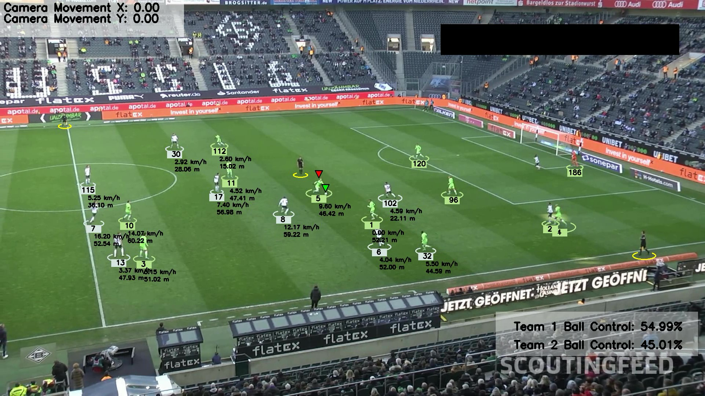

# Soccer Match Analysis Model
<a href="#"></a>
<a href="#"></a>
<a href="#"></a>
<a href="#"></a>
<a href="#"></a>
<a href="#"></a>


## Synopsys 

The goal of this project is to develop a real-time soccer match analysis system utilizing advanced machine learning and computer vision techniques. The system leverages YOLOv8, a state-of-the-art one-stage object detection model, to accurately detect and track players, referees, and soccer balls throughout the game. The model is trained on a custom dataset of approximately 663 images, totaling around 150 MB of data (instructions for accessing the dataset can be found in ```/models/model.txt/```). 

In addition to object detection, the system employs KMeans clustering to segment pixels within a player's bounding box, allowing team assignment based on jersey colors. This segmentation also enables the calculation of each team's ball acquisition percentage. Optical flow is used to track player movement while compensating for camera motion, ensuring precise player tracking. By applying perspective transformation, the model converts pixel movements into real-world measurements, calculating both speed and distance traveled in meters rather than just pixels.

This project integrates object detection, tracking, and advanced analytics to offer valuable insights into team dynamics and individual player performance. Once trained, the system can recognize and track players, referees, and soccer balls in various video feeds, making it a versatile tool for sports analytics.

## Training Data

The training data for this project consists of a custom dataset of approximately 663 images (~150 MB), specifically curated to detect soccer players, referees, and soccer balls. The dataset includes both custom images and publicly available datasets to enhance model performance.

You can find the dataset and input videos in the `/models/` and `input-video` folders, respectively, or access them directly on Kaggle and Roboflow via the following links:

- [Kaggle Football Dataset](https://www.kaggle.com/competitions/dfl-bundesliga-data-shootout/data?select=clips)
- [Roboflow Football Dataset](https://universe.roboflow.com/roboflow-jvuqo/football-players-detection-3zvbc/dataset/1)
  
For detailed instructions on setting up and training the model using Google Colab, including steps for downloading the dataset, organizing files, and running the YOLOv8 training process, please refer to the `models/model.txt` file. This file provides a step-by-step guide, from installing dependencies to saving your trained models.


## Demo
Watch the demo video to see the model in action.

View the sample input video [here](https://drive.google.com/file/d/1t6agoqggZKx6thamUuPAIdN_1zR9v9S_/view)

View the trained YOLOv8 model [here](https://drive.google.com/file/d/1nh3rMsx0ugfTBFWxFbUlE5Rf8tcbPa1j/view?usp=sharing)

## Features:

- **Object Detection & Tracking**: Detects and tracks players, referees, and soccer balls using YOLOv8.
- **Team Assignment**: Uses KMeans clustering to assign players to teams based on their jersey colors.
- **Camera Movement Compensation**: Detects and compensates for camera movement using optical flow.
- **Perspective Transformation**: Translates pixel-based movements into real-world measurements using OpenCV.
- **Performance Metrics**: Calculates player speed and total distance covered during the match.

## Installation
To get started, follow these steps:

1. Clone the repository:
    ```bash
    git clone https://github.com/Abenez3r/Soccer_Match_Analysis.git
    ```

2. Install the dependencies:
    ```bash
    pip install -r requirements.txt
    ```

3. Download and prepare the datasets from the links provided above.

## Usage
Run the project with the following command:

```bash
python main.py
```

## Key Concepts
YOLOv8 Object Detection: Detects and tracks players, referees, and soccer balls in real-time.
KMeans Clustering: Segments and assigns players to teams based on t-shirt colors.
Optical Flow: Tracks camera movement to accurately measure player movement.
Perspective Transformation: Transforms pixel movements into real-world measurements.
Performance Metrics: Calculates speed and distance covered by each player.

## Files/Folders
- `main.py`            Main script to run the object detection and tracking model
- `requirements.txt`   Contains a list of dependencies needed to run the project
- `/model/`            Stores the trained model weights
- `/datasets/`         Folder containing the soccer ball datasets for training

## Requirements
- Python 3.x
- Roboflow
- Ultralytics
- Supervision
- OpenCV
- NumPy
- Matplotlib
- Pandas
- YOLOv8

## Dependencies
To install the necessary Python libraries, use the provided `requirements.txt` file. Detailed instructions for installing Ultralytics, Roboflow, and YOLOv8 are located in the `training1` folder, with further explanations in `models/model.txt`. Ensure that Python 3.x is installed on your system.

